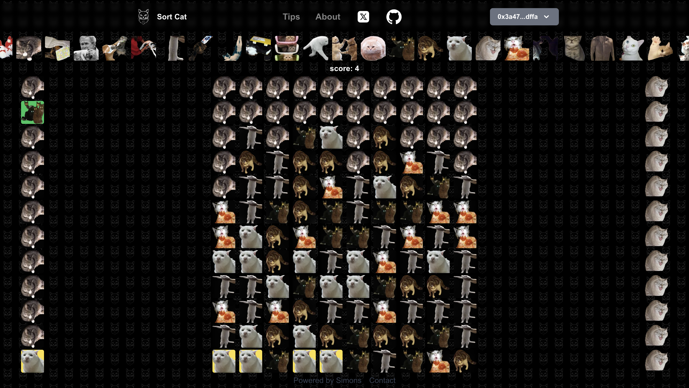

# Preface



# Introduction

This is a game inspired by [Borderlands: Science](https://borderlands.2k.com/zh-CN/).

# Gameplay

The column on the right consists of available cats that can be used. The column on the left represents the cats that need to be aligned. When a user clicks on a cat in the central matrix, the number of cats on the right decreases. If the cats on the right are depleted, it indicates that there are no more cats available.

The cats on the left side are the tasks that need to be aligned.

Players need to maximize the number of aligned cats as much as possible to achieve the highest score.

# Start

```bash
cd frontend
yarn dev
```

# Overview

[Website](https://sortdna.vercel.app/)

# Resource

- https://tailwindcss.com/docs/border-color

- https://app.uniswap.org/

- https://headlessui.com/react/popover
